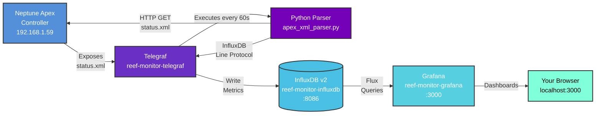

# Reef Monitor

A beautiful, turn-key monitoring solution for your Neptune Apex reef controller using the **TIG Stack** (Telegraf, InfluxDB, and Grafana). Deploy with Docker in minutes and monitor your reef aquarium with stunning visualizations!

## Features

- Real-time monitoring of all Apex probes and sensors
- Beautiful Grafana dashboards with 9 pre-configured panels
- Automated data collection every 60 seconds
- Historical data storage and visualization
- Easy configuration via environment variables
- Persistent data storage across container restarts

## What Gets Monitored

- **Temperature** (Fahrenheit)
- **pH levels** with optimal range display
- **ORP** (Oxidation-Reduction Potential)
- **Salinity/Conductivity** (PPT)
- **Water Level** (inches)
- **Alkalinity** (dKH) - from Trident
- **Calcium** (ppm) - from Trident
- **Magnesium** (ppm) - from Trident
- **Power Consumption** by outlet (Watts)
- **Outlet States** (ON/OFF/AUTO)

## Screenshots

### Main Monitoring Dashboard

*Real-time monitoring of all reef parameters with 9 customizable panels in a 3x3 grid layout*

### KPI Dashboard

*Quick overview of key performance indicators and system health*

## Prerequisites

- Docker Desktop (Windows/Mac) or Docker Engine + Docker Compose (Linux)
- Neptune Apex controller accessible on your network
- Network connectivity between your Docker host and Apex controller

## Quick Start

### 1. Clone or Download This Repository

```bash
git clone https://github.com/austin-mackprang/reef-monitor.git
cd reef-monitor
```

### 2. Configure Your Apex IP Address

Create your configuration file from the example template:

```bash
cd docker
cp .env.example .env
```

Then edit the `.env` file and update your Apex controller's IP address:

```bash
# Edit with your favorite text editor (nano, vim, VS Code, etc.)
nano .env
```

Update these lines to match your Apex controller:
```bash
APEX_IP=192.168.1.59
APEX_ENDPOINT=http://192.168.1.59/cgi-bin/status.xml
```

Save and close the file.

### 3. Start the Stack

Navigate to the docker directory and start all services:

```bash
cd docker
docker-compose up -d
```

This will:
- Pull the necessary Docker images (first time only)
- Create persistent volumes for data storage
- Start InfluxDB, Telegraf, and Grafana containers
- Begin collecting data from your Apex controller

### 4. Access Grafana

Open your browser and navigate to:
- **URL:** `http://localhost:3000`
- **Username:** `admin`
- **Password:** `admin`

You'll be prompted to change the password on first login (optional but recommended).

### 5. View Your Dashboard

The "Reef Monitor" dashboard is automatically provisioned and ready to use:
1. Click on the menu (hamburger icon)
2. Navigate to **Dashboards**
3. Select **Reef Monitor**

You should see data within 60 seconds of startup!

## Architecture



### Data Flow

1. **Neptune Apex** exposes real-time reef controller data via XML endpoint (`status.xml`)
2. **Telegraf** executes the Python parser every 60 seconds via the `exec` input plugin
3. **Python Parser** fetches XML data from the Apex controller via HTTP GET
4. **Python Parser** parses the XML and outputs metrics in InfluxDB Line Protocol format
5. **Telegraf** receives the line protocol output and writes it to InfluxDB
6. **InfluxDB** stores time-series data with full tag support (probe names, types, etc.)
7. **Grafana** queries InfluxDB using Flux and renders beautiful visualizations
8. **Your Browser** accesses the Grafana dashboard at http://localhost:3000

### Components

| Component | Purpose | Technology |
|-----------|---------|------------|
| **Apex Controller** | Data source - reef monitoring hardware | Neptune Systems Apex |
| **XML Parser** | Fetch & parse status.xml into metrics | Python 3 (ElementTree, urllib) |
| **Telegraf** | Data collection agent | Telegraf 1.28 (exec plugin) |
| **InfluxDB** | Time-series database | InfluxDB v2.7 |
| **Grafana** | Visualization platform | Grafana 10.2.0 |

## Project Structure

```
reef-monitor/
├── LICENSE                       # GPL v3 License
├── README.md                     # This file
├── .gitignore                    # Git ignore rules
├── docker/
│   ├── .env.example              # Example configuration (copy to .env)
│   ├── docker-compose.yml        # Service orchestration
│   ├── telegraf/
│   │   ├── telegraf.conf         # Data collection config
│   │   ├── apex_xml_parser.py    # XML parser script
│   │   └── Dockerfile            # Custom Telegraf image
│   └── grafana/
│       ├── datasources/
│       │   └── influxdb.yml      # InfluxDB connection
│       └── dashboards/
│           ├── dashboard.yml     # Dashboard provisioning
│           └── reef-overview.json # Reef Monitor dashboard (9 panels)
├── apex_sample_data/
│   ├── README.md                 # Sample data info
│   └── status.xml                # Example XML from Apex
└── images/                       # Screenshot images
    ├── Monitor-Dashboard.png     # Main monitoring dashboard
    └── KPI-Dashboard.png         # KPI overview dashboard
```

## Configuration

All configuration is managed through the `docker/.env` file:

### Apex Settings
```bash
APEX_IP=192.168.1.59                              # Your Apex IP address
APEX_ENDPOINT=http://192.168.1.59/cgi-bin/status.xml
COLLECTION_INTERVAL=60                            # Data collection interval (seconds)
```

### InfluxDB Settings
```bash
INFLUXDB_USERNAME=admin
INFLUXDB_PASSWORD=adminpassword123                # Change for production!
INFLUXDB_ORG=reef
INFLUXDB_BUCKET=apex
INFLUXDB_TOKEN=my-super-secret-auth-token         # Change for production!
```

### Grafana Settings
```bash
GRAFANA_ADMIN_USER=admin
GRAFANA_ADMIN_PASSWORD=admin                      # Change for production!
```

## Common Operations

### View Logs

```bash
# All services
cd docker
docker-compose logs -f

# Specific service
docker-compose logs -f telegraf
docker-compose logs -f influxdb
docker-compose logs -f grafana
```

### Check Service Status

```bash
cd docker
docker-compose ps
```

Expected output:
```
NAME                     STATUS          PORTS
reef-monitor-grafana     Up 2 minutes    0.0.0.0:3000->3000/tcp
reef-monitor-influxdb    Up 2 minutes    0.0.0.0:8086->8086/tcp
reef-monitor-telegraf    Up 2 minutes
```

### Restart Services

```bash
cd docker

# Restart all services
docker-compose restart

# Restart specific service
docker-compose restart telegraf
```

### Stop the Stack

```bash
cd docker

# Stop (keeps data)
docker-compose stop

# Stop and remove containers (keeps data volumes)
docker-compose down

# Remove everything including data (CAREFUL!)
docker-compose down -v
```

### Update Configuration

After editing `docker/.env`:

```bash
cd docker
docker-compose down
docker-compose up -d
```

## Troubleshooting

### No Data Appears in Grafana

1. **Wait 60 seconds** - Data collection happens every minute
2. **Check Telegraf logs:**
   ```bash
   cd docker
   docker-compose logs telegraf
   ```
3. **Verify Apex is reachable:**
   ```bash
   curl http://192.168.1.59/cgi-bin/status.xml
   ```
4. **Check time range** - In Grafana, try expanding the time range to "Last 6 hours"

### "Failed to Fetch" Error in Grafana

This usually means:
- InfluxDB isn't running or ready yet
- Datasource configuration is incorrect
- Wait 30 seconds for InfluxDB to fully initialize

**Solution:**
```bash
cd docker
docker-compose restart grafana
```

### Cannot Access Apex Controller

1. **Check IP address** in `docker/.env` matches your Apex
2. **Test connectivity:**
   ```bash
   ping 192.168.1.59
   curl http://192.168.1.59/cgi-bin/status.xml
   ```
3. **Firewall:** Ensure no firewall is blocking access
4. **Network:** Docker and Apex must be on accessible networks

### Telegraf Shows "Connection Refused"

- InfluxDB may not be ready yet
- Wait 30 seconds and check logs again
- Try restarting: `docker-compose restart telegraf`

### Dashboard Shows "No Data"

1. **Check InfluxDB has data:**
   - Go to `http://localhost:8086`
   - Login: `admin` / `adminpassword123`
   - Navigate to **Data Explorer**
   - Select bucket: `apex`
   - Check for measurements: `apex_probe`, `apex_outlet`, `apex_system`

2. **Verify Telegraf is collecting:**
   ```bash
   docker-compose logs telegraf | grep "apex_probe"
   ```

## Advanced

### Access InfluxDB Directly

1. Navigate to `http://localhost:8086`
2. Login credentials (from `docker/.env`):
   - Username: `admin`
   - Password: `adminpassword123`
3. Organization: `reef`
4. Bucket: `apex`

Example Flux query to verify data:
```flux
from(bucket: "apex")
  |> range(start: -1h)
  |> filter(fn: (r) => r["_measurement"] == "apex_probe")
  |> filter(fn: (r) => r["probe_type"] == "Temp")
```

### Customize the Dashboard

1. In Grafana, edit panels by clicking the panel title → Edit
2. Modify queries, visualizations, and thresholds
3. Save the dashboard
4. Export JSON: Panel menu → Share → Export → Save to file
5. Replace `docker/grafana/dashboards/reef-overview.json`

### Change Data Collection Interval

Edit `docker/.env`:
```bash
COLLECTION_INTERVAL=30  # Collect every 30 seconds
```

Then restart:
```bash
cd docker
docker-compose restart telegraf
```

### Setup Data Retention

To automatically delete old data:

1. Access InfluxDB at `http://localhost:8086`
2. Go to **Settings** → **Buckets**
3. Edit the `apex` bucket
4. Set retention period (e.g., 30 days, 90 days, etc.)

### Backup Your Data

```bash
# Backup InfluxDB data
docker exec reef-monitor-influxdb influx backup /tmp/backup -t my-super-secret-auth-token
docker cp reef-monitor-influxdb:/tmp/backup ./backup-$(date +%Y%m%d)

# Backup Grafana dashboards (already in git)
```

## Security Considerations

**For Production Use:**

1. **Change Default Passwords** in `docker/.env`:
   - InfluxDB password
   - InfluxDB token
   - Grafana password

2. **Don't Expose Ports** to the internet:
   - Use a reverse proxy with SSL/TLS
   - Implement authentication
   - Consider VPN access

3. **Secure the `.env` file:**
   ```bash
   chmod 600 docker/.env
   ```

4. **Never commit `docker/.env` to git** - It's already in `.gitignore`

## Data Structure

### Measurements Collected

**apex_probe:**
- Fields: `value` (float)
- Tags: `probe_name`, `probe_type`
- Examples: Temperature (Temp), pH, ORP, Salinity (Cond), Water Level (Level), Alkalinity (alk), Calcium (ca), Magnesium (mg)

**apex_outlet:**
- Fields: `output_id` (int), `state` (string)
- Tags: `outlet_name`, `device_id`
- Examples: Return, Heater, Lights, etc.

**apex_system:**
- Fields: `timezone` (float)
- Tags: `hostname`, `software`, `hardware`, `serial`

## Support & Resources

- [Telegraf Documentation](https://docs.influxdata.com/telegraf/)
- [InfluxDB Documentation](https://docs.influxdata.com/influxdb/v2/)
- [Grafana Documentation](https://grafana.com/docs/)
- [Neptune Apex](https://www.neptunesystems.com/)

## What's Different From Previous Version

This version includes several improvements:
- Switched from `datalog.json` to `status.xml` endpoint (more reliable)
- Fixed broken folder structure paths
- Added proper environment variable support via `.env`
- Improved Grafana dashboard with 9 panels (was 4)
- Added Trident data support (Alkalinity, Calcium, Magnesium)
- Added water level monitoring
- Added power consumption monitoring by outlet
- Removed unnecessary files (JSON parser, backup configs)
- Cleaner, more maintainable structure

## Contributing

Contributions are welcome! Here's how you can help:

1. **Report Issues**: Found a bug? Open an issue with details about the problem
2. **Suggest Features**: Have an idea? Create an issue to discuss it
3. **Submit Pull Requests**:
   - Fork the repository
   - Create a feature branch (`git checkout -b feature/amazing-feature`)
   - Commit your changes (`git commit -m 'Add amazing feature'`)
   - Push to the branch (`git push origin feature/amazing-feature`)
   - Open a Pull Request

Please ensure your code follows the existing style and includes appropriate documentation.

## License

This project is licensed under the GNU General Public License v3.0 - see the [LICENSE](LICENSE) file for details.

This means you are free to use, modify, and distribute this software, but any modifications or derivative works must also be released under GPL v3. This ensures that improvements to the project remain open source and benefit the community.

## Acknowledgments

- Built for the [Neptune Systems Apex](https://www.neptunesystems.com/) aquarium controller
- Uses the TIG Stack: [Telegraf](https://www.influxdata.com/time-series-platform/telegraf/), [InfluxDB](https://www.influxdata.com/), and [Grafana](https://grafana.com/)

## Disclaimer

This is an unofficial monitoring solution and is not affiliated with or endorsed by Neptune Systems. Use at your own risk.
